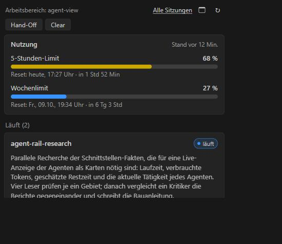

# Claude Code Utilities

VS-Code-Erweiterung für Claude Code: laufende Agenten und Workflows als Karten, dazu 5-Stunden- und Wochenlimit, Hand-Off und Clear.

*English: a VS Code extension for Claude Code with live agent cards, 5-hour and weekly usage, a small floating window and Hand-Off / Clear buttons. German UI, local files only.*



## Was es kann

- **Agenten-Karten:** Status, Modell, Tokens, Laufzeit, Phasen, aktuelle Tätigkeit und eine grobe Restzeit je Workflow und Agent.
- **Nutzung:** 5-Stunden- und Wochenlimit in zwei Zeilen: Prozent, Reset-Zeit und Restzeit. Die Erweiterung führt dafür selbst `/usage` aus.
- **Kleines Fenster:** dieselben Karten in einem eigenen Windows-Fenster, das vor VS Code liegt und mit VS Code schließt.
- **Hand-Off:** schreibt den Kontext einer Sitzung in eine Markdown-Datei. Dazu der Befehl `/handoff`, bei dem Claude die Übergabe selbst schreibt.
- **Clear:** schreibt zuerst ein Hand-Off, öffnet dann eine neue Unterhaltung mit dem Dateipfad schon im Eingabefeld und schließt den alten Chat-Tab. Spart Tokens.

## Installation

Voraussetzungen: VS Code 1.94 oder neuer und die Claude-Code-Erweiterung. Das kleine Fenster braucht Windows und Edge oder Chrome.

**Fertiges Paket:** die Datei `claude-code-usage-agent-view-<Version>.vsix` aus den [Releases](https://github.com/JanDerCoder1/claude-code-usage-agent-view/releases) laden und installieren:

```powershell
code --install-extension claude-code-usage-agent-view-0.9.3.vsix
```

**Selbst bauen** (Node.js 14 oder neuer), die vier Befehle nacheinander:

```powershell
git clone https://github.com/JanDerCoder1/claude-code-usage-agent-view.git
```

```powershell
cd claude-code-usage-agent-view
```

```powershell
node tools/build-vsix.js . dist/claude-code-usage-agent-view-0.9.3.vsix
```

```powershell
code --install-extension dist/claude-code-usage-agent-view-0.9.3.vsix
```

Danach VS Code neu starten. Das Symbol **Claude Code Utilities** erscheint in der Aktivitätsleiste.

## Benutzung

- Ansicht über das Symbol öffnen. Über die Befehlspalette (`View: Move View`, `New Secondary Side Bar Entry`) legst du sie neben den Chat.
- Oben in der Ansicht: Fenster-Symbol (kleines Fenster), Aktualisieren, **Hand-Off** und **Clear**.
- Tokens sparen: `/handoff`, dann `/clear`, dann den ausgegebenen Prompt einfügen. Für `/handoff` die Datei `docs/handoff-command.md` nach `~/.claude/commands/handoff.md` kopieren.

Alle Befehle, Einstellungen (`agentView.*`) und Einzelheiten stehen in der [Anleitung](docs/ANLEITUNG.md).

## Hinweise

- **Nur lesend, nur lokal:** keine Telemetrie, nichts im Internet. Gelesen werden Sitzungsdateien von Claude Code; für das kleine Fenster lauscht die Erweiterung kurz auf `127.0.0.1`. Details im [Datenschutz-Abschnitt](docs/ANLEITUNG.md#datenschutz).
- **Frühe Version, inoffiziell:** geprüft unter Windows 11 mit Claude Code 2.1.x. Das Format der gelesenen Dateien ist nicht dokumentiert, ein Update von Claude Code kann etwas ändern. Nicht von Anthropic.
- **Zahlen mit Vorbehalt:** die Restzeit ist eine Schätzung, Tokens sind die Kontextgröße. Mehr unter [Bekannte Grenzen](docs/ANLEITUNG.md#bekannte-grenzen).

## Lizenz

MIT, siehe [LICENSE](LICENSE). Du darfst die Erweiterung frei nutzen, ändern und weitergeben, solange der Lizenztext mitgeliefert wird.
